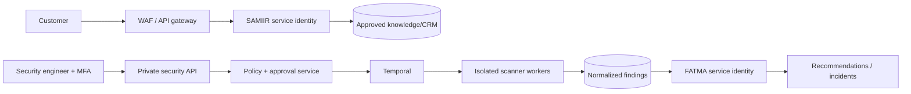

# Architecture

## Trust zones

SAMIIR and FATMA are separate deployment units, workload identities, databases roles, credentials, queues, network policies, audit identities, and tool registries. The gateway can reach SAMIIR but cannot reach scanner workers. FATMA is not exposed by the customer ingress. Kubernetes should enforce default-deny NetworkPolicies and service-mesh mTLS.

## Request enforcement

OIDC authentication -> tenant binding -> RBAC/ABAC policy -> schema validation -> tool allowlist -> approval/payload-hash validation -> action adapter -> append-only audit. The model can propose typed input but cannot grant permission. Retrieved records and telemetry are delimited as untrusted data and stripped of secrets before model context.

## Data

PostgreSQL uses UUID keys, tenant foreign keys, RLS policies, pgvector HNSW retrieval, ciphertext fields for PII, exclusions to prevent appointment overlap, and immutable audit hash-chain fields. The application must start each transaction with `SET LOCAL app.tenant_id = :tenant` and use separate non-owner DB roles because table owners bypass RLS by default.

## Agent runtime

Use OpenAI Agents SDK with Responses API, structured Pydantic tool arguments, tracing with sensitive-data capture disabled, per-agent API projects/keys, and no dynamic tool registration. SAMIIR receives only effective, unexpired, approved knowledge. FATMA receives normalized/redacted signals and cannot execute containment directly.
